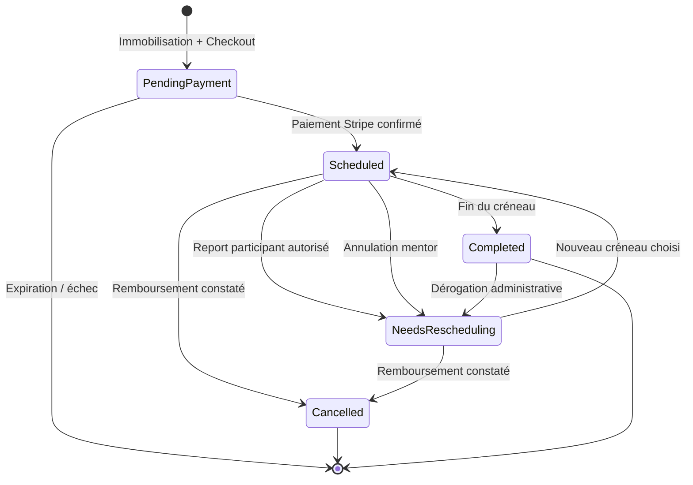

# Domaine Mentoring

Document de conception évolutif pour la réservation de sessions de mentoring.

## Glossaire

- **Mentor** : personne qui définit ses disponibilités et assure les sessions.
- **Participant** : utilisateur qui réserve et paie une session.
- **Session** : rendez-vous de mentoring d'une durée et d'un prix définis.
- **Disponibilité récurrente** : plage horaire applicable à un jour de la semaine.
- **Exception de calendrier** : règle datée qui remplace les disponibilités récurrentes pour un jour précis.
- **Créneau** : intervalle réservable calculé à partir des disponibilités, des exceptions et des sessions déjà engagées.

## ADR-001 — Un seul mentor pour le MVP

**Statut :** accepté

### Contexte

La première version permet à Jonathan de vendre ses propres sessions de mentoring. La prise en charge de plusieurs mentors introduirait notamment la gestion des profils, des droits, des calendriers, des tarifs et des reversements.

### Décision

Le MVP ne gère qu'un seul mentor. Le tarif envisagé est de 60 € pour une session d'une heure. Le modèle métier ne doit toutefois pas empêcher une évolution ultérieure vers plusieurs mentors.

### Conséquences

- Il n'y a ni inscription de mentors ni marketplace.
- Les disponibilités sont administrées uniquement par Jonathan.
- Le paiement est encaissé directement par le site, sans mécanisme de reversement à un tiers.

## ADR-002 — Réservation réservée aux utilisateurs authentifiés

**Statut :** accepté

### Contexte

Une réservation doit être rattachée de manière fiable à un participant afin de gérer le paiement, les notifications, l'historique et les éventuelles opérations après-vente.

### Décision

Seul un utilisateur connecté à son compte Grafikart peut accéder au parcours de réservation, y compris à la consultation des disponibilités.

### Conséquences

- La session est reliée à un utilisateur existant.
- Les coordonnées et l'historique du compte peuvent être réutilisés.
- Aucun état de sélection n'a besoin d'être préservé à travers une connexion ou une création de compte.

## ADR-003 — Immobilisation temporaire pendant le paiement

**Statut :** accepté

### Contexte

Deux participants peuvent tenter de payer simultanément le même créneau. Attendre la confirmation du paiement pour le bloquer exposerait le système à une double réservation.

### Décision

Le démarrage du paiement crée une réservation temporaire qui immobilise le créneau pendant 30 minutes. La session Stripe Checkout expire au même instant. La réservation devient confirmée uniquement après réception et validation côté serveur de l'événement de paiement réussi. Elle expire si le paiement n'aboutit pas dans le délai imparti.

La durée initialement envisagée de 15 minutes a été abandonnée car Stripe Checkout impose une expiration minimale de 30 minutes.

### Conséquences

- Un créneau temporairement immobilisé n'est plus proposé aux autres participants.
- L'expiration doit supprimer la réservation temporaire et libérer le créneau même si aucun retour navigateur n'a lieu.
- Le webhook du prestataire de paiement constitue la source de vérité, et non la redirection du navigateur.
- La création et la confirmation doivent être idempotentes.
- Une contrainte transactionnelle doit empêcher deux immobilisations actives pour le même créneau.
- La tâche d'expiration locale et l'expiration Stripe doivent rester cohérentes ; une session Checkout expirée ne peut pas être réutilisée.
- Les tentatives expirées ne sont pas conservées dans l'historique métier.

## ADR-004 — L'annulation prend la forme d'un report

**Statut :** accepté

### Contexte

Le participant peut ne plus être disponible pour le créneau réservé, mais l'annulation ne doit pas déclencher de remboursement.

### Décision

L'annulation d'un créneau payé conserve le paiement et fait passer la réservation dans un état « à replanifier ». L'ancien créneau est libéré et le participant doit en sélectionner un nouveau. Aucun remboursement automatique n'est effectué.

Le participant peut effectuer un seul report en autonomie, jusqu'à 24 heures avant le début de la session. Après cette échéance ou si ce droit a déjà été utilisé, une intervention administrative est nécessaire.

### Conséquences

- Le paiement appartient à la réservation et non à une occurrence horaire particulière.
- L'historique des changements de créneau doit être conservé.
- Une réservation à replanifier ne bloque aucun créneau.
- Le mentor doit pouvoir déroger au délai depuis l'administration.
- Le nombre de reports effectués doit être conservé, même si la réservation revient temporairement à l'état « à replanifier ».

## ADR-005 — Préavis minimum de réservation

**Statut :** accepté

### Décision

Un créneau n'est réservable que s'il commence au moins 24 heures après l'instant courant. Cette règle s'applique à une première réservation comme à un report.

Les réservations sont ouvertes sur un horizon glissant de 40 jours.

Un tampon de 15 minutes est appliqué après chaque session. Ce tampon n'appartient pas à la session facturée, mais empêche le démarrage d'une autre session pendant cet intervalle.

### Conséquences

- Le moteur de créneaux doit appliquer ce seuil en temps réel.
- Le moteur ne doit générer aucun créneau au-delà de 40 jours à partir de l'instant courant.
- Deux sessions consécutives doivent être séparées par au moins 15 minutes.
- Le contrôle doit être répété côté serveur lors de l'immobilisation du créneau.
- L'administration peut conserver la possibilité de créer ou déplacer manuellement une session avec un préavis plus court.

## ADR-006 — Plusieurs plages récurrentes par jour

**Statut :** accepté

### Décision

Chaque jour de la semaine peut être indisponible ou contenir une ou plusieurs plages de disponibilité récurrentes, par exemple de 9 h à 12 h puis de 14 h à 18 h.

### Conséquences

- Deux plages d'un même jour ne peuvent pas se chevaucher.
- Une plage ne peut pas traverser minuit ; son heure de fin est strictement postérieure à son heure de début.
- Le moteur produit les créneaux d'une heure contenus dans ces plages.
- L'interface d'administration permet d'ajouter et de retirer des plages indépendamment.

## ADR-007 — Les exceptions datées remplacent la récurrence

**Statut :** accepté

### Décision

Une exception définie pour une date remplace entièrement les disponibilités récurrentes qui auraient dû s'appliquer ce jour-là. Elle déclare soit une indisponibilité totale, soit une ou plusieurs plages spécifiques.

L'administration permet également de sélectionner une période de plusieurs jours pour les rendre indisponibles en une seule opération. Cette action crée une exception journalière pour chaque date ; elle ne crée pas un nouveau type de règle métier.

### Conséquences

- Les plages récurrentes et les plages datées ne sont jamais fusionnées.
- Supprimer une exception rétablit automatiquement l'application de la règle récurrente.
- Une exception peut rendre disponible un jour habituellement indisponible.
- Les horaires spécifiques restent configurés date par date.

## ADR-007b — Les changements de disponibilité ne déplacent pas les réservations

**Statut :** accepté

### Décision

Une modification de règle récurrente ou une exception datée n'annule et ne déplace aucune réservation déjà confirmée. Elle affecte uniquement le calcul des créneaux encore libres.

### Conséquences

- L'administration avertit le mentor lorsqu'une modification entre en conflit avec une réservation existante.
- Le mentor doit explicitement annuler ou replacer la réservation concernée.
- Une réservation confirmée reste bloquante même si elle ne correspond plus aux règles de disponibilité courantes.

## ADR-007c — Aucun quota global

**Statut :** accepté

### Décision

Le MVP n'impose aucun nombre maximal de sessions par jour, par semaine ou par participant. La capacité du mentor est déterminée exclusivement par ses plages de disponibilité, ses exceptions, les réservations actives et les tampons.

### Conséquences

- Le moteur n'a pas de règle de quota supplémentaire.
- Le mentor réduit sa capacité en ajustant son calendrier.

## ADR-007d — Une seule semaine type active

**Statut :** accepté

### Décision

Le MVP conserve une seule semaine type, sans historique de versions ni date d'entrée en vigueur. Toute modification s'applique immédiatement au calcul de toutes les dates futures non réservées.

### Conséquences

- Les exceptions datées servent à déroger ponctuellement à la semaine type.
- Les réservations confirmées ne sont pas recalculées.

## ADR-008 — Gestion des fuseaux horaires

**Statut :** accepté

### Décision

Le mentor saisit ses règles de disponibilité dans le fuseau `Europe/Paris`. Le participant voit les créneaux convertis dans le fuseau détecté par son navigateur, avec le nom du fuseau clairement affiché et la possibilité de le modifier. Les occurrences réservées sont enregistrées comme des instants UTC.

### Conséquences

- Les règles récurrentes restent exprimées en heure locale de Paris et suivent ses changements d'heure saisonniers.
- Une exception est attachée à une date du calendrier du mentor.
- Les communications doivent mentionner l'heure et le fuseau adaptés à leur destinataire.
- Le serveur reste la source de vérité pour la conversion et la validation du créneau au moment de sa réservation.

## ADR-009 — Grille de début au quart d'heure

**Statut :** accepté

### Décision

Les heures de début proposées sont alignées sur une grille de 15 minutes dans le fuseau du mentor. Un créneau n'est proposé que si la session d'une heure tient entièrement dans une plage de disponibilité et respecte les réservations et leurs tampons.

### Conséquences

- Une plage de 10 h à 12 h peut produire les débuts 10 h 00, 10 h 15, 10 h 30, 10 h 45 et 11 h 00 en l'absence d'autres contraintes.
- Le tampon d'une réservation existante élimine tous les candidats qui le chevauchent.

## ADR-009b — Sélecteur de créneaux

**Statut :** accepté

### Décision

Le participant choisit son créneau dans un calendrier mensuel limité aux 40 jours ouverts. Seules les dates possédant au moins un créneau sont sélectionnables. Après sélection d'une date, les heures disponibles sont affichées dans le fuseau choisi par le participant.

Un raccourci permet d'atteindre le prochain créneau disponible.

### Conséquences

- Les jours sans créneau restent visibles mais désactivés.
- Le changement de fuseau recalcule les libellés sans changer les instants proposés.
- Le frontend n'est jamais la source de vérité : le serveur revalide le créneau lors de son immobilisation.

## ADR-009c — Ordre du parcours de réservation

**Statut :** accepté

### Décision

Le participant est déjà authentifié avant d'entrer dans le parcours. Il :

1. consulte et sélectionne un créneau, sans le bloquer ;
2. saisit le sujet obligatoire et la description Markdown facultative ;
3. clique sur « Payer 60 € » ;
4. le serveur revalide et immobilise atomiquement le créneau pendant 30 minutes ;
5. il est immédiatement redirigé vers Stripe Checkout.

### Conséquences

- Une simple consultation ou sélection ne bloque aucun créneau.
- Si le créneau a été pris avant l'immobilisation, le participant revient au sélecteur avec une explication.
- L'immobilisation et la création de la session Checkout forment une opération cohérente ; un échec de création chez Stripe doit libérer le créneau.

## ADR-010 — Paiement Stripe et transaction existante

**Statut :** accepté

### Contexte

Le site possède déjà une intégration Stripe, un traitement des webhooks et une table `transactions` utilisée par le domaine Premium.

### Décision

Le MVP accepte uniquement les paiements Stripe et réutilise le système de transactions existant. La réservation n'est confirmée qu'à partir d'un événement Stripe validé côté serveur.

Une session d'une heure coûte 60 € TTC. Ce montant est le total présenté et encaissé au Checkout ; la part de taxe applicable est ventilée dans la transaction.

Le tarif et la durée sont des valeurs applicatives fixes, non modifiables depuis l'administration. Chaque réservation en conserve néanmoins un instantané de 6 000 centimes TTC et 60 minutes.

### Conséquences

- Le flux doit conserver les garanties existantes autour des identifiants Stripe et de l'idempotence.
- Une transaction de mentoring doit pouvoir être distinguée d'un achat Premium et reliée à sa réservation.
- Le champ `duration` actuel, orienté vers les mois de Premium, ne suffit pas à représenter à lui seul une session de mentoring ; l'évolution exacte du modèle de transaction reste à concevoir.
- PayPal est hors périmètre du MVP.
- Le participant ne doit pas découvrir de supplément au moment du paiement.
- La configuration Stripe existante force explicitement `card` ; elle couvre aussi les portefeuilles carte compatibles proposés par Checkout et exclut les moyens différés.
- La configuration fiscale dynamique existante est réutilisée, tout en garantissant que le total encaissé reste de 60 € TTC.

## ADR-010b — Généralisation des transactions

**Statut :** accepté

### Décision

La table `transactions` reçoit une relation polymorphe optionnelle vers l'objet acheté. Une transaction de mentoring est reliée à sa réservation ; les transactions Premium existantes restent compatibles pendant la transition.

Les attributs comptables communs — utilisateur, montant, taxe, frais, méthode, identifiant fournisseur, coordonnées de facturation et remboursement — restent centralisés dans `transactions`.

### Conséquences

- Les revenus peuvent être agrégés globalement ou filtrés par type d'achat.
- L'unicité de l'identifiant de paiement Stripe doit être garantie.
- Le champ historique `duration`, spécifique au Premium, ne doit pas être utilisé pour représenter la durée d'une session.
- La migration doit tolérer les anciennes lignes qui ne possèdent pas encore de cible polymorphe.

## ADR-010c — Effet d'un remboursement

**Statut :** accepté

### Décision

Un remboursement exceptionnel effectué depuis l'administration ou constaté via Stripe marque la transaction comme remboursée et annule définitivement la réservation associée.

### Conséquences

- L'éventuel créneau est immédiatement libéré.
- La réservation ne peut plus être replanifiée.
- Le participant et le mentor reçoivent les notifications d'annulation.
- Une annulation iCalendar est envoyée.
- Le traitement du même événement de remboursement doit être idempotent.

## ADR-011 — Alertes du mentor

**Statut :** accepté

### Décision

Le mentor reçoit une notification interne Grafikart et un e-mail lorsqu'une réservation est confirmée ou reportée. L'alerte est déclenchée à partir du changement d'état validé côté serveur.

### Contenu minimal

- identité du participant ;
- date et heure en `Europe/Paris` ;
- sujet communiqué pour la session ;
- lien vers la réservation dans l'administration.

### Conséquences

- Un paiement abandonné ou une simple redirection navigateur ne génère pas d'alerte de confirmation.
- Les notifications peuvent réutiliser l'infrastructure interne et les canaux e-mail existants.
- Un report doit indiquer l'ancien et le nouveau créneau.

## ADR-012 — Confirmation et rappels du participant

**Statut :** accepté

### Décision

Après confirmation, le participant reçoit une notification interne Grafikart et un e-mail. Deux rappels par e-mail sont programmés 24 heures puis 1 heure avant le début de la session.

Chaque communication présente l'horaire dans le fuseau choisi par le participant, le sujet, le lien de visioconférence et, lorsque le report est encore autorisé, un lien vers cette action.

### Conséquences

- Les rappels doivent être rattachés à la version courante du créneau afin qu'un report invalide les anciens envois.
- Le rappel à 24 heures peut coïncider avec la clôture du report autonome ; le calcul exact doit éviter de proposer une action déjà expirée.
- Une session reportée doit produire une nouvelle confirmation.

## ADR-013 — Informations de préparation

**Statut :** accepté

### Décision

Avant le paiement, le participant renseigne :

- un sujet et un objectif obligatoires ;
- une description facultative en Markdown, saisie avec l'éditeur du site, pouvant notamment contenir des liens vers un dépôt, un site, une maquette ou un document.

L'identité et l'adresse e-mail proviennent du compte Grafikart authentifié.

### Conséquences

- Le contenu Markdown doit être validé et rendu avec la chaîne de sanitisation du site.
- Les informations sont attachées à la réservation et restent disponibles après un report.
- Le mentor peut les consulter depuis l'administration et les reçoit dans ses alertes, dans une forme adaptée au canal.
- Le participant peut modifier le sujet et la description jusqu'à 24 heures avant le début de la session.
- Une modification après paiement déclenche une notification interne pour le mentor, sans e-mail supplémentaire.
- Après l'échéance, ces informations sont en lecture seule pour le participant mais restent modifiables administrativement.
- Le sujet et la description sont anonymisés automatiquement un an après la réalisation de la session.
- Les données transactionnelles suivent un cycle de conservation distinct.

## ADR-014 — Visioconférence hébergée par kMeet

**Statut :** accepté

### Contexte

Une solution audio/vidéo embarquée ajouterait au projet des contraintes WebRTC, d'infrastructure, de sécurité et d'exploitation sans constituer le cœur de la réservation.

### Décision

Grafikart n'héberge et n'embarque pas la visioconférence. Chaque session confirmée possède un lien vers une salle kMeet, vers lequel le mentor et le participant sont redirigés.

La salle doit fournir l'audio, la vidéo, le partage d'écran, le choix des périphériques et le chat, sans enregistrement demandé par Grafikart.

Pour le MVP, le serveur génère un identifiant cryptographiquement aléatoire et construit l'URL kMeet correspondante. La création simple d'une salle ne nécessite pas d'appel à l'API kMeet.

### Conséquences

- Le lien ne doit être visible que par le mentor et le participant authentifié.
- L'identifiant de salle doit être aléatoire et impossible à deviner.
- Un report conserve la réservation et la même salle, sauf révocation manuelle.
- Grafikart ne peut pas garantir qu'un lien déjà divulgué cesse de fonctionner chez le fournisseur ; la régénération de la salle est hors périmètre du MVP.

## ADR-015 — Pas de synchronisation avec un calendrier externe

**Statut :** accepté

### Décision

Le MVP ne consulte aucun calendrier Google, Infomaniak ou autre pour déterminer les périodes occupées. Les disponibilités récurrentes, les exceptions datées et les réservations actives dans Grafikart constituent les seules entrées du moteur.

### Conséquences

- Le mentor doit reproduire ses indisponibilités externes sous forme d'exceptions dans Grafikart.
- Aucun accès OAuth à un calendrier tiers n'est requis.
- Une intégration en lecture seule pourra être ajoutée ultérieurement sans modifier les règles métier principales.

## ADR-016 — Invitations iCalendar

**Statut :** accepté

### Décision

Les e-mails de confirmation destinés au participant et au mentor contiennent une invitation iCalendar (`.ics`). Elle inclut l'horaire, le fuseau, le sujet et le lien kMeet.

En cas de report, une mise à jour utilisant le même identifiant iCalendar est envoyée afin que les logiciels compatibles modifient l'événement existant.

### Conséquences

- Chaque réservation possède un UID iCalendar stable.
- Le numéro de séquence de l'événement augmente à chaque changement de créneau.
- Une annulation administrative définitive devra envoyer une annulation iCalendar.

## ADR-017 — Annulation d'un créneau par le mentor

**Statut :** accepté

### Décision

Lorsque le mentor annule une session confirmée, l'ancien créneau est libéré et la réservation repasse à l'état « à replanifier ». Cette opération ne consomme pas l'unique report autonome accordé au participant.

Le participant reçoit immédiatement une notification interne, un e-mail et l'annulation iCalendar de l'ancien événement.

### Conséquences

- Le système doit distinguer l'auteur et la cause d'un changement de créneau.
- Le compteur de reports du participant n'est incrémenté que lorsqu'il initie lui-même le report.
- Le paiement et les informations de préparation restent attachés à la réservation.

## ADR-018 — Aucun délai d'expiration pour la replanification

**Statut :** accepté

### Décision

Une réservation payée à l'état « à replanifier » n'expire pas automatiquement. Le participant conserve son droit à sélectionner un nouveau créneau sans limite de temps.

### Conséquences

- Le système doit conserver durablement ces réservations et les rendre visibles dans le compte du participant.
- Les changements futurs de tarif ou de durée ne modifient pas automatiquement le droit déjà acheté.
- Une clôture ou un remboursement éventuel nécessite une intervention administrative explicite.

## ADR-019 — Clôture automatique de la session

**Statut :** accepté

### Décision

Une réservation planifiée devient automatiquement « réalisée » à la fin de son créneau. Le système ne distingue pas une session effectivement tenue d'une absence du participant.

La session est alors consommée et n'ouvre pas automatiquement un nouveau droit à réservation. Le mentor peut exceptionnellement replacer la réservation à l'état « à replanifier » depuis l'administration.

### Conséquences

- Aucune clôture manuelle ni télémétrie kMeet n'est nécessaire.
- L'état « absent » n'existe pas dans le modèle.
- La dérogation administrative doit être tracée.

## ADR-020 — Fenêtre d'accès à kMeet

**Statut :** accepté

### Décision

Le bouton et l'URL permettant de rejoindre la salle kMeet sont accessibles dans Grafikart à partir de 10 minutes avant le début de la session et jusqu'à 15 minutes après sa fin prévue.

### Conséquences

- Les e-mails et invitations calendrier ne doivent pas contenir directement l'URL kMeet ; ils pointent vers la page de réservation authentifiée.
- La page révèle l'URL tierce uniquement pendant la fenêtre autorisée.
- Une URL déjà copiée ne peut pas être révoquée par ce masquage.

## ADR-021 — Plusieurs réservations par participant

**Statut :** accepté

### Décision

Un utilisateur peut acheter et détenir plusieurs réservations simultanément, qu'elles soient planifiées ou à replanifier. Chaque paiement de 60 € TTC crée un droit indépendant à une session d'une heure.

### Conséquences

- Aucune limite par utilisateur ne s'ajoute aux contraintes générales de disponibilité.
- Les paiements, reports et états sont suivis séparément pour chaque réservation.

## ADR-022 — Blocage de la suppression du compte

**Statut :** accepté

### Décision

La suppression autonome d'un compte est refusée si l'utilisateur possède une réservation temporairement immobilisée, future ou à replanifier. Il est invité à contacter le support.

### Conséquences

- La règle doit compléter le flux de suppression de compte existant.
- Une réservation réalisée ou définitivement annulée ne bloque pas la suppression.
- Le support doit résoudre les droits encore ouverts avant de permettre la suppression.

## ADR-023 — Périmètre de l'administration

**Statut :** accepté

### Décision

L'administration permet :

- de lister et filtrer les réservations à venir, à replanifier et passées ;
- de consulter le participant, le contenu Markdown et la transaction ;
- d'annuler un créneau au nom du mentor, ce qui remet la réservation à replanifier ;
- d'accorder exceptionnellement une nouvelle replanification ;
- de gérer la semaine type et les exceptions datées.

Elle ne permet pas de choisir manuellement un nouveau créneau, de régénérer le lien kMeet ou de déclencher un remboursement.

### Conséquences

- Le participant choisit toujours lui-même son nouveau créneau.
- Un remboursement réalisé hors de ce CMS et reçu via Stripe conserve les effets définis dans l'ADR-010c.

## ADR-024 — Le compte administrateur est le mentor

**Statut :** accepté

### Décision

Le site ne possède qu'un compte administrateur. Ce compte représente également l'unique mentor et accède aux fonctions de mentoring via le CMS existant.

### Conséquences

- Aucun nouveau rôle ou système de permissions n'est nécessaire pour le MVP.
- Une évolution vers plusieurs administrateurs ou mentors nécessitera de revoir l'autorisation d'accès aux contenus de préparation.

## Modèle de domaine

### Entités

- **WeeklyAvailability** : plages récurrentes d'un jour de semaine, exprimées en heure de Paris.
- **AvailabilityException** : remplacement complet de la règle récurrente pour une date de Paris.
- **MentoringBooking** : droit payé à une session et, lorsqu'il est planifié, son occurrence horaire.
- **Transaction** : trace comptable générique reliée polymorphiquement à la réservation.
- **BookingScheduleHistory** : historique de chaque attribution et libération de créneau, avec son auteur et sa cause.

### États d'une réservation

- `PendingPayment` : créneau immobilisé pendant au plus 30 minutes, sans transaction confirmée.
- `Scheduled` : paiement confirmé et créneau attribué.
- `NeedsRescheduling` : paiement conservé, mais aucun créneau attribué.
- `Completed` : fin du créneau atteinte ; le droit est consommé.
- `Cancelled` : réservation définitivement clôturée, notamment après remboursement.

Une tentative `PendingPayment` expirée est supprimée et ne devient pas un état historique.

### Invariants

- Une réservation confirmée possède exactement une transaction non remboursée.
- Une réservation `Scheduled` possède exactement un créneau ; `NeedsRescheduling` n'en possède aucun.
- Un même participant peut posséder plusieurs réservations.
- Deux réservations actives ne peuvent chevaucher ni leur session ni le tampon de 15 minutes.
- Le début d'un créneau est aligné sur un quart d'heure et la session tient entièrement dans une disponibilité effective.
- Une réservation confirmée continue d'exister même si les disponibilités changent.
- Seul un webhook Stripe authentifié confirme le paiement.
- Un report participant n'est autorisé qu'une fois et jusqu'à 24 heures avant le début.
- Un report initié par le mentor ne consomme pas ce droit.
- Le prix et la durée enregistrés sont immuables après paiement.
- Une réservation remboursée reste conservée dans l'état final `Cancelled`, distinct de l'état de sa transaction.

## Architecture proposée

### Stockage

- `mentoring_weekly_availabilities` stocke le jour de semaine et les minutes de début et de fin.
- `mentoring_availability_exceptions` stocke une date locale ; ses plages enfants sont vides pour une indisponibilité complète.
- `mentoring_bookings` stocke l'utilisateur, l'état, le créneau UTC éventuel, son fuseau d'affichage, l'expiration du paiement, l'identifiant Checkout, le secret de salle, les instantanés de prix et durée, le contenu de préparation et le compteur de reports.
- `mentoring_booking_schedule_histories` trace les anciens et nouveaux créneaux, l'auteur et la cause.
- `transactions` reçoit une cible polymorphe nullable pour relier une transaction à une réservation sans casser les lignes Premium historiques.

Les noms définitifs doivent suivre les conventions des modèles voisins au moment de l'implémentation.

### Calcul d'un créneau

Pour une date donnée :

1. prendre l'exception datée si elle existe, sinon les plages de la semaine type ;
2. interpréter ces plages en `Europe/Paris`, puis les convertir en instants UTC ;
3. générer des débuts au quart d'heure pour lesquels 60 minutes tiennent dans la plage ;
4. retirer les débuts situés à moins de 24 heures ou au-delà de l'horizon de 40 jours ;
5. retirer tout candidat qui chevauche une réservation active ou son tampon de 15 minutes ;
6. convertir les libellés restants dans le fuseau choisi par le participant.

La même validation est rejouée sous verrou transactionnel lors de l'immobilisation. Le verrou doit protéger les chevauchements d'intervalles, pas uniquement l'égalité des heures de début : les créneaux de 10 h 00 et 10 h 15 sont concurrents.

### Paiement

Le Checkout de mentoring réutilise le client Stripe existant avec les différences suivantes :

- métadonnées explicites `purchase_type=mentoring` et `booking_id` sur la session et le PaymentIntent ;
- expiration Stripe et locale synchronisée à 30 minutes ;
- prix total de 6 000 centimes TTC et configuration carte identique au Premium ;
- confirmation idempotente de la réservation et création d'une transaction générique ;
- suppression de la réservation temporaire après expiration.

Le routage actuel du `PaymentEvent` Premium par recherche d'un plan ayant le même montant ne peut pas être réutilisé : un achat doit être identifié par ses métadonnées, faute de quoi une session de 60 € pourrait être prise pour un plan Premium au même prix.

### Tâches planifiées et files

- une tâche fréquente supprime les immobilisations expirées et expire leur Checkout si nécessaire ;
- une tâche marque les sessions terminées comme réalisées ;
- une tâche programme ou envoie les rappels à H−24 et H−1 ;
- une tâche anonymise le contenu de préparation un an après réalisation ;
- les e-mails et notifications sont envoyés en file après validation de la transaction en base.

Chaque tâche est idempotente afin de supporter plusieurs exécutions et reprises.

### Interfaces

**Compte participant**

- sélecteur de date, heure et fuseau ;
- formulaire de préparation et redirection Stripe ;
- liste des réservations actives, à replanifier et passées ;
- détail d'une réservation, modification du contenu avant H−24 et action de report lorsqu'elle est autorisée ;
- bouton kMeet visible uniquement pendant la fenêtre H−10 à fin+15 minutes.

**CMS**

- semaine type avec plusieurs plages par jour ;
- exceptions datées et raccourci d'indisponibilité sur une période ;
- liste filtrable et détail des réservations ;
- annulation par le mentor et remise exceptionnelle à replanifier.

## Ordre d'implémentation

1. Modèle de données, états et moteur pur de calcul des créneaux.
2. Gestion CMS de la semaine type et des exceptions.
3. Sélecteur participant et formulaire de préparation.
4. Immobilisation concurrente, Checkout Stripe et routage des webhooks.
5. Espace participant, reports et actions CMS.
6. Notifications, invitations iCalendar, rappels et lien kMeet.
7. Nettoyage, clôture automatique, anonymisation et blocage de suppression du compte.

## Scénarios critiques à vérifier

- deux utilisateurs tentent de payer des débuts différents mais qui se chevauchent ;
- un Checkout expire sans retour du navigateur ;
- un webhook Stripe est reçu deux fois ou après traitement de l'expiration ;
- une exception supprime une disponibilité sans déplacer une réservation existante ;
- un changement d'heure Europe/Paris ne décale pas les règles récurrentes ;
- un report participant est refusé à moins de 24 heures ou après utilisation de son droit ;
- une annulation mentor ne consomme pas le droit de report ;
- les anciens rappels et événements iCalendar sont invalidés après report ;
- le lien kMeet n'est révélé ni trop tôt ni après sa fenêtre ;
- un remboursement Stripe clôture la réservation sans double notification ;
- la suppression du compte est bloquée tant qu'un droit reste ouvert.
- Le tarif et la durée doivent-ils être modifiables dans l'administration ?
- Quelles méthodes de paiement Stripe autoriser dans Checkout ?
